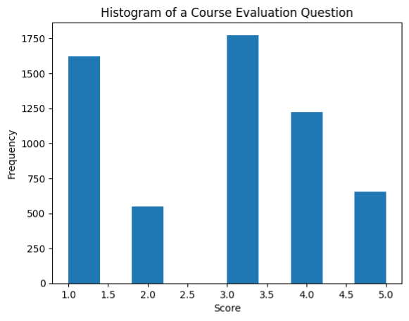
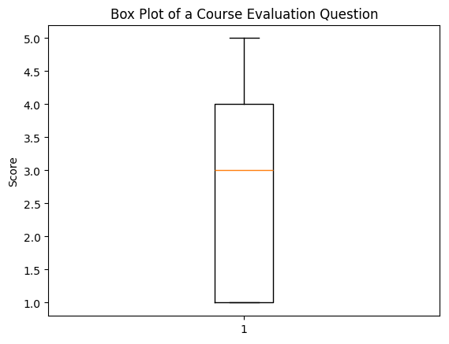
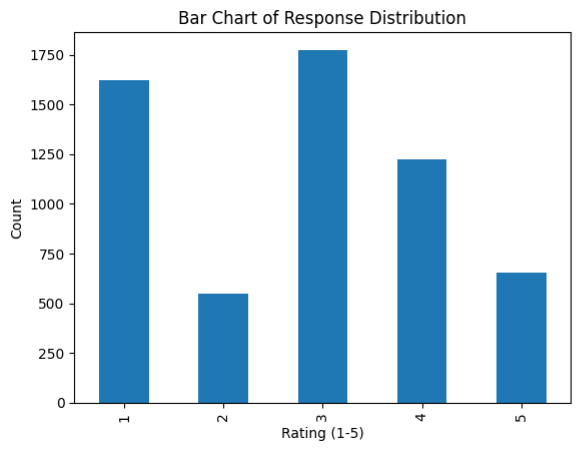
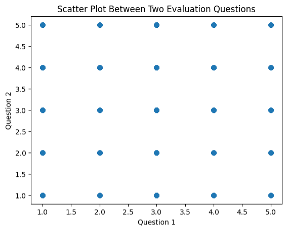
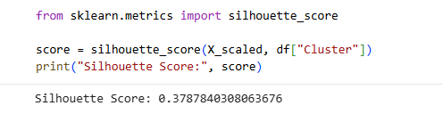

# Student Evaluation Analysis using Machine Learning

## Introudction
This project applies **K-Means clustering** to analyze student evaluation data from the **Turkiye Student Evaluation dataset**

The goal is to identify patterns in student feedback and group similar responses into meaningful clusters to support educational insights and decision-making.

## Objective
- Identify patterns in student evaluation responses
- Group students into clusters based on satisfaction levels
- Analyze similarities and differences between clusters
- Support data-driven decision-making in education

## Dataset
 Source: UCI Machine Learning Repository
- Records: 5,820 student records
- Features: 33 variables (Likert scale: 1–5)

[turkiye-student.csv](https://raw.githubusercontent.com/emmanuelemedeke-wq/Analysis-of-Turkiye-Student-Evaluation/refs/heads/main/turkiye-student.csv)

## Exploratory Data Analysis (EDA) & Visualizations  

### Histogram

 Most responses fall between **3 and 4**, indicating moderate to high satisfaction.

---

### Box Plot

 Median around **3**, showing overall balanced evaluations.

---

### Bar Chart

 Ratings **3 and 4 dominate**, confirming positive feedback trends.

---

### Scatter Plot

 Positive relationship between evaluation questions → students tend to rate consistently.

---

## Methodology

### Data Preprocessing
- Standardized features using `StandardScaler`
- Ensured all variables contribute equally to clustering

### Clustering Algorithm
- Applied **K-Means Clustering**

---

## Methods
- Data preprocessing (cleaning, scaling)
- Exploratory Data Analysis (EDA)
- K-Means clustering
- Elbow Method & Silhouette Score for model evaluation

 ## Cluster Evaluation 

### Elbow Method

Optimal number of clusters: **k = 3**

---

### Silhouette Score

 Score ≈ **0.38** → Moderate cluster separation

---

## Results & Insights

Three distinct clusters were identified:

- **Cluster 1:** High satisfaction (ratings ≈ 4–5)
- **Cluster 2:** Low satisfaction (ratings ≈ 1–2)
- **Cluster 3:** Moderate satisfaction (ratings ≈ 3)

This segmentation helps institutions:
- Identify areas needing improvement
- Understand student satisfaction patterns
- Improve teaching strategies

## Tools & Technologies:
- Python
- Pandas
- NumPy
- Scikit-learn
- Matplotlib

##  Author
Emmanuel Emedeke  
Graduate Student – Data Analytics (UMGC)

---

## Key Skills Demonstrated
- Data preprocessing & scaling
- Exploratory Data Analysis (EDA)
- K-Means clustering
- Model evaluation (Elbow Method, Silhouette Score)
- Data visualization

