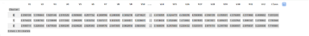
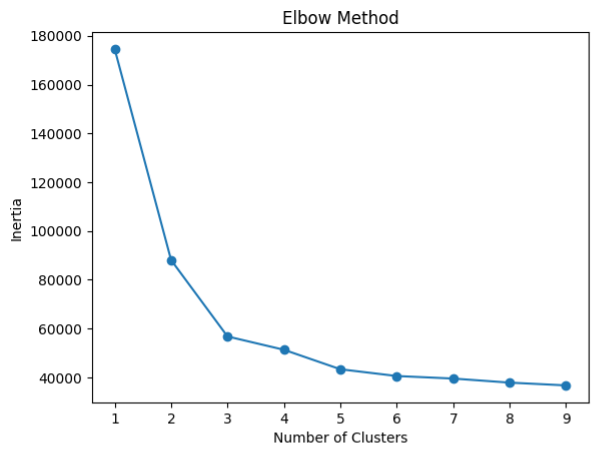

# Student Evaluation Analysis using Machine Learning

## Introudction
This project analyzes 5,800+ student evaluation records using machine learning techniques to identify patterns in student satisfaction and engagement

## Dataset
- 5,800+ student records
- Features include evaluation scores and feedback metrics

## Methods
- Data preprocessing (cleaning, scaling)
- Exploratory Data Analysis (EDA)
- K-Means clustering
- Elbow Method & Silhouette Score for model evaluation

## Results
- Identified 3 clusters:
  - High satisfaction
  - Moderate satisfaction
  - Low satisfaction
- Provided insights into student engagement trends

  ## Visualizations

### Clustering Results

### Elbow Method

## Tools & Technologies:
- Python
- Pandas
- Scikit-learn
- Matplotlib

